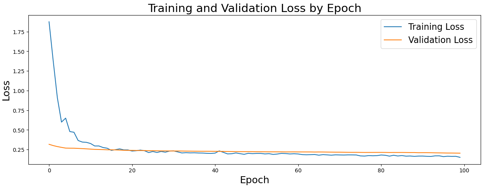
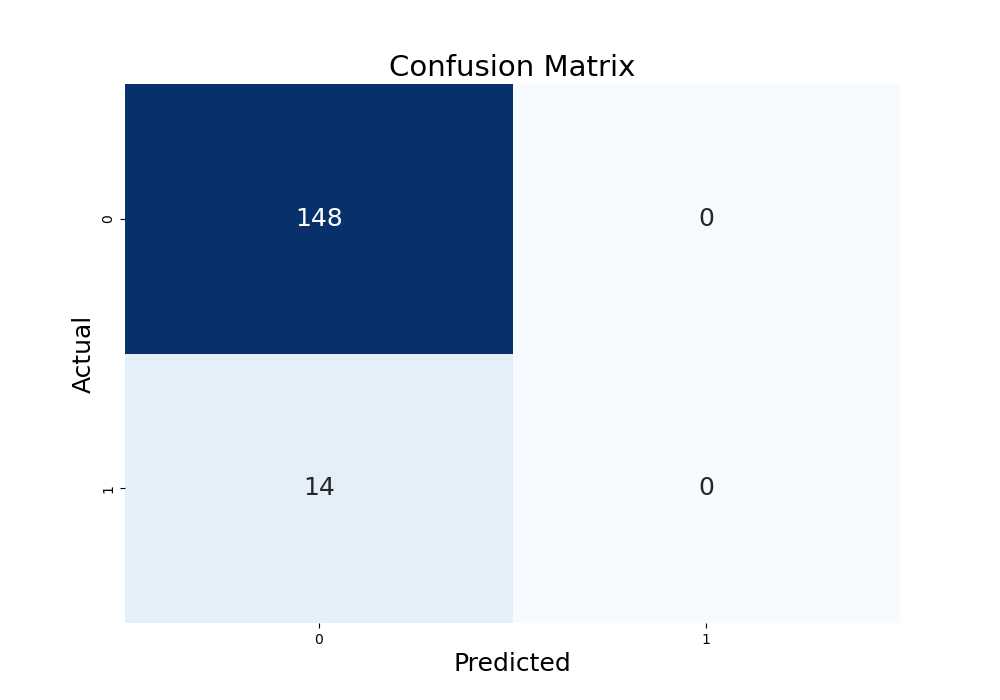

# Economic Crisis Predictooor

The goal of this project is to attempt predicting banking crises using different indices for various Latin American countries. We are using data from The World Bank, the Heritage Foundation’s Economic Freedom Index, the Fraser Institute’s Economic Freedom Index, and Reinhart and Rogoff’s dataset recording economic crises for their book “This Time Is Different” was used for the generation of these models. 

### Tools
Python with TensorFlow and Keras machine learning libraries, and MatLab with Classification Learner.

## MatLab
In order to view the Decision Tree in MatLab, use the following code:
view(trainedModel.ClassificationTree,'Mode','graph')

Change "trainedModel" for whatever you named your model to.

## Python
### Dependencies
---------------
pip install "tensorflow<2.11" 
pip install wbgapi 

optional

pip install netron 
pip install seaborn 
pip install plotly 

### Data
Most of the data was gathered from World Bank [website](https://datatopics.worldbank.org/world-development-indicators/) 
It can be selected manually on the website or pulled with an API  
### API
There is a great library called [wbgapi](https://github.com/tgherzog/wbgapi) that can pull the data from World Bank API 
API key is not necessary to request data! 
 
Here is one approach on how to gather it 
<pre>import wbgapi as wb</pre>
Search function can be used to get indicator codes, titles, and their descriptions for desired category  
<pre> wb.search('debt') </pre>
Country codes can be acquired with this command 
<pre>wb.economy.coder(['your_country_1', your_country_2'])</pre>
Finally, a time period can be specified by setting it equal to a variable  
<pre>time_range = range(1960, 2010)</pre>
Now the API can be called! 
<pre>economic_data = wb.data.DataFrame(indicator_series_dupless_short, country_codes, time_range)
print(economic_data) </pre>
At the time of this writing there appears to be a cap on request size 
The maximum we were able to gather was 55 indicators and 34 countries at a time 

## Models 
Tree sampling and neural net models have been used so far with limited effectiveness.

### Neural Net
Even though it seems like our neural net is improving and making better predictions, 

it does not actually try to predict the occurence of a banking crisis, only the lack thereof.  

## Findings
So far, we have not found a great way to predict a banking crisis. 

